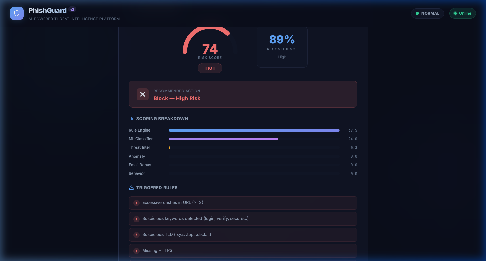
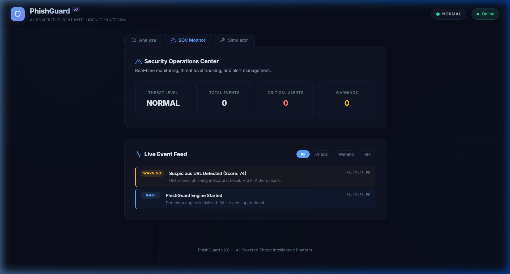
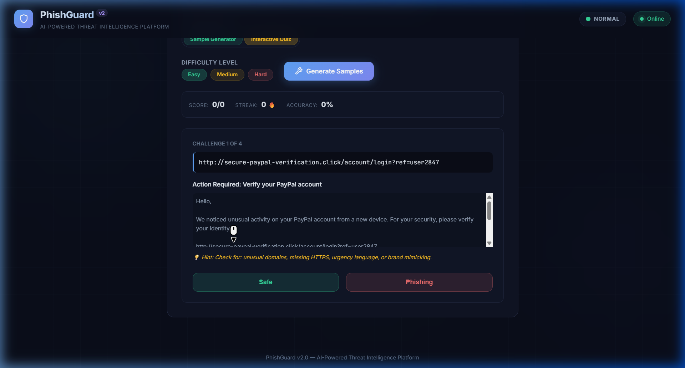
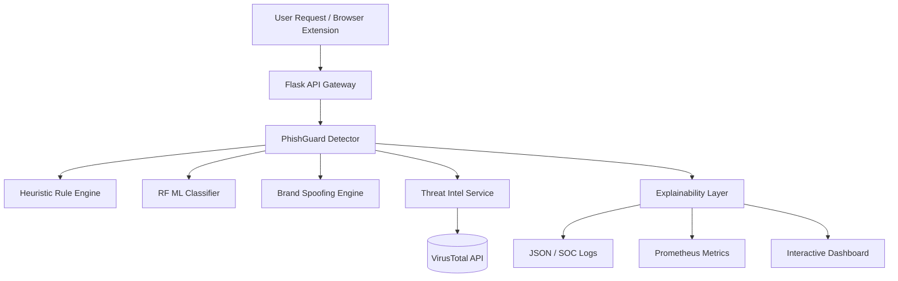

<div align="center">

# PhishGuard 🛡️

### Enterprise-Grade AI-Powered Phishing Detection & Response

[](https://python.org)
[](https://flask.palletsprojects.com)
[](https://scikit-learn.org)
[](https://docker.com)
[](https://kubernetes.io)
[](http://localhost:5000/apidocs)

**PhishGuard** is a multi-layered security platform that identifies phishing threats using heuristic rule engines, **Random Forest** machine learning, and context-aware brand spoofing detection.

</div>

---

## 📸 Platform Overview

### Analysis Dashboard

*Real-time threat assessment with Explainable AI (XAI) breakdown and triggered rule alerts.*

### Security Operations Center (SOC)

*Centralized telemetry, threat level tracking, and persistent event logging.*

### Phishing Awareness Simulator

*Gamified training module to educate users on identifying sophisticated phishing attempts.*

---

## 🏗️ Architecture



---

## 🚀 Quick Start

### 🐳 Docker (Recommended)
```bash
git clone https://github.com/yourusername/PhishGuard.git
cd PhishGuard

# Launch with Docker Compose
docker-compose up --build -d
```
Access at **http://localhost:5000**

### 🐍 Local Installation (Manual)
1. **Setup Environment:**
   ```bash
   python -m venv venv
   source venv/bin/activate  # Windows: venv\Scripts\activate
   pip install -r requirements.txt
   ```
2. **Configuration:**
   Set your API keys:
   ```bash
   export PHISHGUARD_API_KEY="YOUR-SECURE-KEY"
   export VIRUSTOTAL_API_KEY="YOUR-VT-KEY"
   ```
3. **Run Platform:**
   ```bash
   python app.py
   ```

---

## 🔐 Developer & Enterprise APIs

PhishGuard provides a fully documented REST API secured by `X-API-Key` authentication.

- **Interactive API Docs:** [http://localhost:5000/apidocs](http://localhost:5000/apidocs)
- **Monitoring:** [http://localhost:5000/metrics](http://localhost:5000/metrics) (Prometheus format)

### Example Analysis Request
```bash
curl -X POST http://localhost:5000/analyze \
     -H "Content-Type: application/json" \
     -H "X-API-Key: YOUR-SECURE-KEY" \
     -d '{"url": "http://secure-login.paypa1.xyz/"}'
```

---

## 📊 Performance & Robustness
The platform includes an automated **Adversarial Testing Suite** to ensure detection of:
- **Unicode/Homoglyph Attacks** (Cyrillic character substitution)
- **Punycode/IDN Obfuscation** 
- **URL Padding & Hex-Encoding**

Run validation tests:
```bash
python -m pytest tests/test_adversarial.py
```

---

## ⚖️ License
MIT License. Developed for enterprise security research and phishing awareness.
